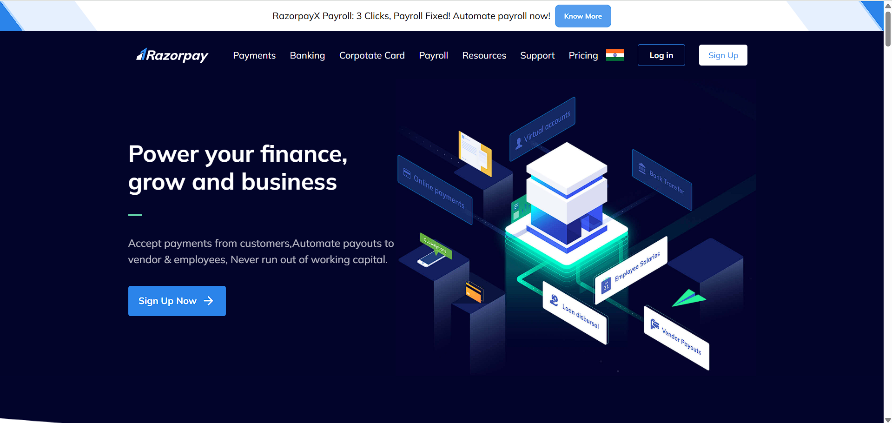

# Razorpay Clone

A responsive UI clone of the Razorpay payment gateway, built using **HTML** and **Tailwind CSS**.

---

## Live Demo

Experience the project live:  
👉 [https://razorpay-clone-001.netlify.app/](https://razorpay-clone-001.netlify.app/)

---

## Features

- Responsive design
- Clean and modern UI
- Built with HTML and Tailwind CSS
- Mimics the Razorpay homepage layout

---

## Screenshot

  

---

## Installation

1. Clone the repository:
   ```bash
   git clone https://github.com/Suhani-01/Razorpay-clone.git
   cd Razorpay-clone
   ```
2. Install dependencies :
    ```bash
    npm install
    ```
3. Run 
    ```bash
    npm start
    ```

---

✨ Thanks for visiting!
